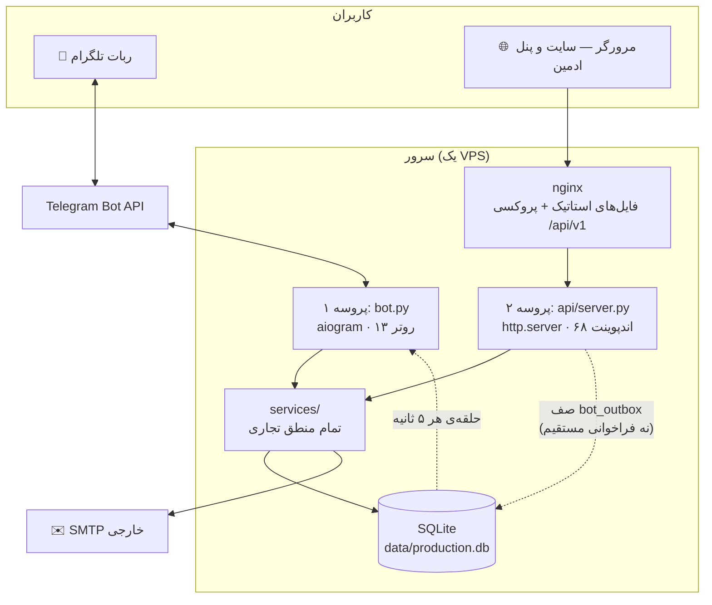

# ۰۲ — معماری

## شکل کلی سیستم

سه چیز روی یک سرور اجرا می‌شوند و **فقط یک فایل SQLite** را به اشتراک
می‌گذارند:



### دو پروسه، صفر RPC

`bot.py` و `api/server.py` **دو پروسه‌ی سیستم‌عاملی جدا هستند که هرگز
مستقیم با هم حرف نمی‌زنند.** نه HTTP بینشان، نه صف پیام، نه سوکت.

- **منطق مشترک از راه `import`** — هر دو `services/` را وارد می‌کنند. یعنی
  رزرو از سایت و رزرو از تلگرام دقیقاً همان تابع را اجرا می‌کنند. منطق
  تجاری فقط **یک بار** نوشته شده.
- **پیام تلگرام از راه دیتابیس** — API نمی‌تواند به تلگرام پیام بدهد (توکن
  و حلقه‌ی aiogram دست پروسه‌ی دیگری است). پس یک ردیف در جدول `bot_outbox`
  می‌نویسد و حلقه‌ی بات هر چند ثانیه آن را برمی‌دارد و می‌فرستد. این تنها
  کانال ارتباطی بین دو پروسه است.

چرا این‌طور؟ چون هر دو پروسه به یک فایل SQLite دسترسی دارند و SQLite
همزمانی چندپروسه‌ای را خودش مدیریت می‌کند. اضافه کردن Redis یا یک صف واقعی
فقط برای فرستادن چند پیام، یک وابستگی بیشتر برای دیپلوی می‌آورد بدون سود
متناسب.

**پیامد عملی:** اگر تغییری در `services/` دادی، **هر دو سرویس** باید ریستارت
شوند، نه فقط API.

## لایه‌بندی

```
handlers/ (تلگرام)     api/server.py (HTTP)      ← لایه‌ی انتقال
        └──────────────┬──────────────┘
                  services/                      ← منطق تجاری
                       │
             database/repositories/              ← دسترسی به داده
                       │
                   SQLite
```

قانون سخت‌گیرانه: **لایه‌ی انتقال منطق ندارد.** داکسترینگ خود
`api/server.py` این را صریح گفته: هر مسیر فقط ورودی را می‌خواند، یک تابع در
`services/` صدا می‌زند، و یک dict برمی‌گرداند. دلیلش هم عملی است — اگر روزی
این فایل با FastAPI جایگزین شود، هیچ منطقی از دست نمی‌رود.

هر ماژول در `database/repositories/` **صاحب یک جدول** است و تنها جایی است
که SQL آن جدول نوشته می‌شود.

## تصمیم‌های معماری و دلیلشان

این بخش مهم‌ترین قسمت این سند است: هر تصمیم غیرمعمول، دلیلش، و اینکه عوض
کردنش چقدر کار دارد.

### ۱. چرا `http.server` استاندارد به‌جای FastAPI

**تصمیم:** API با کتابخانه‌ی استاندارد پایتون نوشته شده، بدون فریمورک.

**دلیل:** محیطی که این پروژه در آن ساخته شد به اینترنت دسترسی نداشت و
`pip install fastapi` ممکن نبود. این در داکسترینگ خود فایل ثبت شده.

**هزینه‌ی تغییر: کم.** چون هیچ منطقی داخل این فایل نیست، مهاجرت به FastAPI
یک کار مکانیکی است: هر شاخه‌ی `if path == …` می‌شود یک `@app.get`. اگر
روزی مستندات خودکار OpenAPI یا اعتبارسنجی نوع خواستی، این کار ارزشش را دارد.

**عوارضی که باید بدانی:** مسیریابی دستی است (`if path == …` و `re.match`)،
پس یک مسیر جدید که به `do_GET`/`do_POST`/… اضافه نشود، بی‌صدا ۴۰۴ می‌دهد.
دقیقاً همین باعث شد دکمه‌ی حذف رویداد هفته‌ها بی‌کار به نظر برسد.

### ۲. چرا SQLite به‌جای PostgreSQL

**تصمیم:** یک فایل SQLite، بدون سرور دیتابیس.

**دلیل:** مقیاس واقعی این کسب‌وکار — یک سالن، چند اجرا در هفته، ده‌ها رزرو
در روز. SQLite برای این حجم بیش از حد کافی است، بکاپش کپی کردن یک فایل است،
و دیپلوی یک وابستگی کمتر دارد.

**هزینه‌ی تغییر: متوسط.** SQL نوشته‌شده ساده و استاندارد است، ولی چند جا از
رفتار خاص SQLite استفاده شده (`INSERT OR IGNORE`، مایگریشن مبتنی بر
try/except روی `ALTER TABLE`). مهاجرت نیاز به بازنویسی `schema.py` و
`connection.py` دارد، نه کل کد.

**کِی باید نگران شد:** اگر نوشتن‌های همزمان زیاد شود (`database is locked`)،
یا اگر خواستی چند سرور بالا بیاوری. تا آن روز، این تصمیم درست است.

### ۳. چرا ORM نداریم

**تصمیم:** `sqlite3` خام با کوئری‌های دستی در `repositories/`.

**دلیل:** کوئری‌ها ساده‌اند و مهم‌ترین منطق همزمانی سیستم (قفل صندلی) به
کنترل دقیق روی جمله‌ی `UPDATE` نیاز دارد — چیزی که ORM پنهانش می‌کند.

**قانون همراهش:** هر رشته‌ی SQL که در بیش از یک جا تکرار شود، باید به یک
ثابت مرجع تبدیل شود. تجربه‌ی تلخش هست: لیست وضعیت‌های «صندلی‌گیر» در شش
کوئری کپی شده بود و وقتی وضعیت جدیدی اضافه شد، به هیچ‌کدام اضافه نشد و
صندلی‌ها بی‌صدا آزاد می‌شدند.

### ۴. چرا فرانت‌اند بدون فریمورک و بدون build

**تصمیم:** HTML/CSS/JS ساده. نه React، نه npm، نه bundler، نه TypeScript.

**دلیل:** سایت عمدتاً محتوایی است و پنل ادمین فرم‌محور. دیپلوی یعنی کپی
کردن فایل‌ها. هر کسی با دانش پایه‌ی وب می‌تواند نگهداری کند — که برای یک
مجموعه‌ی کوچک، مهم‌تر از راحتی توسعه‌دهنده است.

**هزینه‌ی تغییر: زیاد** و **توصیه نمی‌شود** مگر تیم دائمی فرانت داشته باشی.

**عوارضی که باید بدانی:** ترتیب `<script>`ها معنادار است (`app.js` قبل از
`site.js`)؛ حالت مشترک با متغیرهای سراسری اداره می‌شود؛ و بعد از هر دیپلوی
باید کش مرورگر را رد کرد.

### ۵. چرا تنظیمات در دیتابیس‌اند نه در `.env`

**تصمیم:** ۶۴ کلید تنظیمات در جدول `settings`، قابل ویرایش از پنل و از ربات.
`.env` فقط رازها و مسیرها.

**دلیل:** صریح در داکسترینگ `config/settings.py` آمده: هر چیزی که یک ادمینِ
غیربرنامه‌نویس باید بتواند عوض کند — قیمت، ظرفیت، شماره کارت، متن‌های سایت،
قالب ایمیل‌ها — نباید نیاز به دیپلوی داشته باشد.

**پیامد:** «متن سایت را عوض کن» تقریباً هیچ‌وقت تغییر کد نیست. اول در
`settings` بگرد.

### ۶. چرا فارسی/RTL یک محدودیت درجه‌یک است

این یک «بومی‌سازی» که بعداً اضافه شده باشد نیست؛ در پایه‌ی سیستم است:

- تبدیل تقویم جلالی (`utils/jalali.py`)
- نرمال‌سازی ارقام فارسی در ورودی‌ها (`utils/persian_text.py`, `validators.py`)
- شکل‌دهی حروف و ترتیب دوطرفه برای PDF (`arabic-reshaper` + `python-bidi`،
  چون reportlab پشتیبانی RTL ندارد)
- ۵۲۷ خط متن فارسی متمرکز در `texts/fa.py`
- کل CSS با `dir="rtl"` نوشته شده

هر قابلیت جدیدی که متن یا تاریخ نشان می‌دهد، باید از همین مسیرها رد شود.

### ۷. چرا ادمین وب و ادمین تلگرام دو سیستم جدا هستند

`admins` با `telegram_id` کار می‌کند و رمز عبور ندارد (هویت را تلگرام تأیید
می‌کند). `web_admins` نام کاربری + هش رمز دارد و JWT می‌گیرد. یک آدم برای
دسترسی به هر دو، باید در هر دو جدول ردیف داشته باشد.

**دلیل:** این‌ها دو دنیای احراز هویت متفاوت‌اند و یکی‌کردنشان یعنی یا باید
به ادمین‌های تلگرامی رمز بدهی یا به ادمین‌های وب حساب تلگرام تحمیل کنی.

## مسیر یک درخواست

### رزرو از سایت
```
مرورگر → nginx → api/server.py: POST /api/v1/reservations
   → اعتبارسنجی ورودی (تلفن/نام/ایمیل)
   → reservation_service.start_reservation_web()
       → users_repo.get_or_create_customer()      ← ادغام هویت
       → reservations_repo.create_reservation_locked()  ← بررسی ظرفیت و درج، اتمیک
   → پاسخ JSON با مهلت پرداخت
```

### تأیید رسید از پنل
```
پنل → POST /api/v1/admin/reservations/<id>/approve
   → بررسی JWT
   → reservation_service.approve_reservation()
       → set_status_if_any(id, ("pending_review","needs_correction"), "approved")
       → ticket_service: کد + QR امضاشده + PDF
       → ایمیل به مشتری
       → bot_outbox.enqueue(...)   ← پیام تلگرام، غیرمستقیم
```

## ساختار پوشه‌ها

```
bot/                     بک‌اند — هر دو پروسه از اینجا اجرا می‌شوند
  bot.py                 پروسه‌ی ربات؛ init_db() اینجا صدا زده می‌شود
  api/server.py          پروسه‌ی API
  config/settings.py     خواندن .env و انتخاب فایل دیتابیس بر اساس ENV
  database/
    schema.py            ۲۴ جدول + مایگریشن‌ها + DEFAULT_SETTINGS
    connection.py        اتصال به SQLite (هر فراخوانی یک اتصال تازه)
    repositories/        ۲۱ ماژول، هرکدام صاحب یک جدول
  services/              ۱۳ سرویس — تمام منطق تجاری
  handlers/              ۱۳ روتر aiogram
  keyboards/ states/     دکمه‌ها و ماشین‌های حالت ربات
  texts/fa.py            همه‌ی متن‌های فارسی ربات
  utils/                 جلالی، QR، PDF، ایمیل، زمان‌بند، لاگ
  data/                  فایل‌های دیتابیس (در گیت نیست)
  media/ private_media/  آپلودها؛ رسیدهای پرداخت در private_media
  deploy/                یونیت‌های systemd و نمونه‌ی nginx
website/                 فرانت‌اند استاتیک
  index.html  pages/     ۱۰ صفحه‌ی عمومی + ۱۱ صفحه‌ی پنل ادمین
  assets/js|css|images/
docs/                    همین مستندات
actor-portfolio/         ⚠️ سایت قدیمی و متروک — بخش ۱۰ را ببین
```

## مقیاس‌پذیری — کِی این معماری کم می‌آورد

صادقانه: تا چند صد رزرو در روز مشکلی نیست. علائم هشدار به ترتیب احتمال:

1. **`database is locked`** — یعنی نوشتن‌های همزمان از دو پروسه زیاد شده.
   اولین قدم فعال کردن حالت WAL در SQLite است، نه مهاجرت.
2. **کند شدن پاسخ API** — `http.server` چندنخی است ولی سبک نیست؛ اینجا جای
   مهاجرت به FastAPI + uvicorn است.
3. **کند شدن ارسال انبوه ایمیل** — همین الان هم غیرهمزمان و صف‌محور است،
   ولی هر ایمیل یک اتصال SMTP تازه باز می‌کند.

---

بعدی: [`03-data-model.md`](03-data-model.md) — جدول‌ها و ماشین وضعیت رزرو.
