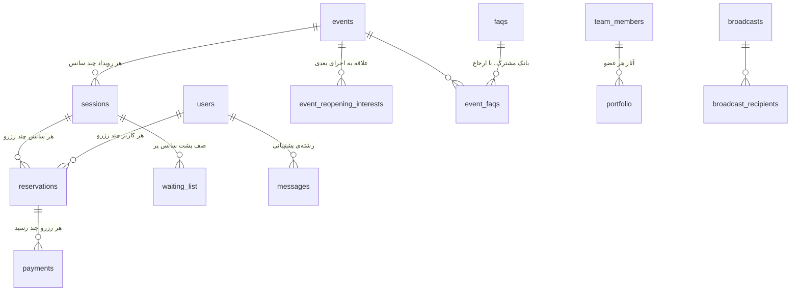
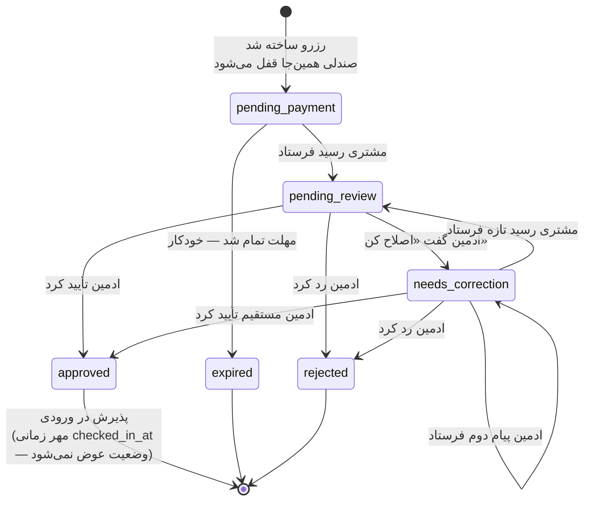

# ۰۳ — مدل داده

یک فایل SQLite، ۲۴ جدول، نسخه‌ی اسکیما **۱۹**. همه‌چیز در
`bot/database/schema.py` تعریف شده (~۱٬۰۶۰ خط، پرکامنت — بخوانش).

## روابط اصلی



**زنجیره‌ی حیاتی:** `events → sessions → reservations → payments`، و همه با
`ON DELETE CASCADE` به هم وصل‌اند. یعنی **حذف یک رویداد، رزروها و رسیدهایش
را هم پاک می‌کند** — به همین دلیل مسیر حذف رویداد در API اگر رزرو تأییدشده
وجود داشته باشد، اول `409` برمی‌گرداند و تأیید دوم می‌خواهد.

## فهرست جدول‌ها

| جدول | چیست |
|---|---|
| `users` | هر مشتری، از تلگرام یا سایت. یک آدم = یک ردیف (ادغام بر اساس تلفن/ایمیل) |
| `events` | رویداد/نمایش. ۲۹ ستون: دوزبانه، پوستر/گالری/ویدیو، آدرس، قیمت، ملاحظات بلیت |
| `sessions` | اجرای مشخص: تاریخ + ساعت + ظرفیت. یکتا روی (رویداد، تاریخ، ساعت) |
| `reservations` | رزرو: خریدار، سانس، تعداد، قیمت، **`status`**، منبع، `expires_at`، `checked_in_at` |
| `payments` | رسیدهای پرداخت. `receipt_source` = تلگرام یا سایت |
| `waiting_list` | «این سانس پر است، من را در صف بگذار» |
| `event_reopening_interests` | «این رویداد اجرا ندارد، خبرم کن» — **جدا از لیست انتظار** |
| `settings` | ۶۴ کلید قابل‌ویرایش توسط ادمین + ~۱۶ کلید داخلی |
| `admins` | کارکنان سمت تلگرام، با `telegram_id`. `pending_removal_at` = حذف تأخیری مالک |
| `admin_groups` | عضویت در بسته‌های دسترسی نام‌دار |
| `web_admins` | حساب‌های پنل وب: نام کاربری + هش رمز → JWT |
| `logs` | رد ممیزی با `target_type`/`target_id` |
| `portfolio` | آثار رزومه. از v18 هر ردیف به یک `team_members` تعلق دارد |
| `team_members` | «اعضای خانه ماورا» — پروفایل عمومی هر عضو |
| `faqs` + `event_faqs` | بانک پرسش‌های متداول + اتصال چندبه‌چند به رویدادها |
| `bank_cards` | کارت‌های بانکی مجموعه؛ همیشه یکی فعال، با چرخش اختیاری |
| `channel_boards` | نگاشت (رویداد، تاریخ، بخش) → `message_id` تلگرام برای برد زنده |
| `customer_otp` + `telegram_link_tokens` | ورود مشتری با کد یک‌بارمصرف ایمیلی |
| `bot_outbox` | **صف بین دو پروسه** — API می‌نویسد، ربات تحویل می‌دهد |
| `messages` | صندوق پشتیبانی، یک رشته به‌ازای هر مشتری |
| `broadcasts` + `broadcast_recipients` | ارسال گروهی ایمیل + وضعیت تحویل هر گیرنده |
| `schema_meta` | یک ردیف: نسخه‌ی فعلی اسکیما |

## ماشین وضعیت رزرو

**مهم‌ترین منطق کل سیستم.** اگر فقط یک بخش از این مستندات را می‌خوانی،
همین باشد.



> **پذیرش در ورودی یک وضعیت نیست.** از v19 هر دو مسیر پذیرش (ربات و پنل
> وب) فقط ستون `checked_in_at` را مهر می‌زنند و وضعیت `approved` را
> دست‌نخورده می‌گذارند. قبلاً مسیر ربات وضعیت را `used` می‌کرد و چون همه‌ی
> کوئری‌های درآمد و حاضرین روی `status = 'approved'` فیلتر می‌کنند، آن بلیت
> از گزارش مالی حذف و صندلی‌اش آزاد می‌شد.

### کدام وضعیت‌ها صندلی نگه می‌دارند

تعریف مرجع: `SEAT_HOLDING_STATUSES` در
`bot/database/repositories/sessions.py`.

```
pending_payment · pending_review · needs_correction · awaiting_buyer_confirmation · approved
```

هرچه بیرون این لیست باشد (`rejected`، `expired`، `cancelled`) صندلی را
آزاد می‌کند. بلیتی که وارد سالن شده همچنان `approved` است و صندلی‌اش را
نگه می‌دارد — پذیرش، وضعیت را عوض نمی‌کند.

> ⚠️ **این تنها تعریف است و شش کوئری ظرفیت از آن می‌خوانند.** اگر وضعیت
> جدیدی اضافه کردی که باید صندلی نگه دارد و به این لیست اضافه نکردی،
> صندلی‌ها **بی‌سروصدا** آزاد می‌شوند — نه خطایی، نه لاگی. ستون `status`
> متن آزاد است و هیچ محدودیتی ندارد، پس مقدار ناشناخته فقط از همه‌ی
> فیلترها می‌افتد بیرون. این دقیقاً در ۲۰۲۶-۰۹-۱۰ اتفاق افتاد.

نکته‌ی مهم: **صندلی از لحظه‌ی ساخت رزرو قفل می‌شود، قبل از هر پرداختی.**
این عمدی است — وگرنه دو نفر همزمان آخرین صندلی را می‌خریدند.

### جدول کامل گذارها

| از | به | با کدام تابع | نکته |
|---|---|---|---|
| — | `pending_payment` | `start_reservation()` / `start_reservation_web()` / `create_manual_reservation()` | `expires_at` از تنظیم `payment_expiry_minutes` |
| `pending_payment` | `pending_review` | `submit_receipt()` | ارسال رسید تکراری `False` می‌دهد تا ادمین دوبار خبردار نشود |
| `needs_correction` | `pending_review` | `submit_receipt()` | همان تابع — ارسال مجدد بعد از اصلاح |
| `pending_review` | `needs_correction` | `request_correction()` | ایمیل + پیام تلگرام با توضیح اینکه چه چیزی اصلاح شود |
| `needs_correction` | `needs_correction` | `request_correction()` | گذار به خود: ادمین پیام دوم می‌فرستد |
| `pending_review` / `needs_correction` | `approved` | `approve_reservation()` | صدور کد + QR امضاشده + ایمیل بلیت PDF |
| `pending_review` / `needs_correction` | `rejected` | `reject_reservation()` | صندلی فوراً آزاد، مشتری با ذکر دلیل مطلع |
| `pending_payment` | `expired` | `expire_stale_reservations()` (زمان‌بند) | **فقط `pending_payment` را هدف می‌گیرد** |
| هر وضعیت صندلی‌گیر | `cancelled` | `admin_cancel_reservation()` | با `set_status_if_any(SEAT_HOLDING_STATUSES)`؛ روی رزرو منقضی/ردشده `False` می‌دهد |

**پذیرش در ورودی گذار وضعیت نیست** و عمداً در این جدول نیست: `set_checked_in()`
فقط `checked_in_at` را مهر می‌زند. یک جمله‌ی `UPDATE` با شرط
`WHERE checked_in_at IS NULL` — پس دو نفر که هم‌زمان یک QR را اسکن کنند،
فقط یکی «اولین اسکن امشب» می‌گیرد.

### چرا «نیازمند اصلاح» ویژه است

سه خاصیت که باید با هم درست بمانند:
1. **صندلی قفل می‌ماند** — چون در `SEAT_HOLDING_STATUSES` هست.
2. **مهلت برداشته می‌شود** — چون زمان‌بند فقط `pending_payment` را می‌بیند.
   (توجه: ستون `expires_at` پاک **نمی‌شود**؛ فقط دیگر خوانده نمی‌شود.)
3. **تصمیم نهایی با ادمین است** — `approve`/`reject` هر دو مستقیماً از این
   وضعیت کار می‌کنند.

اگر روزی یکی از این سه شکست، دو تست موجود در `test_bot.py` باید بگیرندش.

### انضباط همزمانی — تعهد اصلی سیستم

هر گذار معنادار از این دو تابع رد می‌شود:

```python
set_status_if(id, expected, new)          # UPDATE … WHERE id=? AND status=?
set_status_if_any(id, (expected,…), new)  # UPDATE … WHERE id=? AND status IN (…)
```

وضعیت **در همان جمله‌ای که عوض می‌شود بررسی می‌شود**. اگر `False`/`None`
برگشت یعنی کس دیگری زودتر رسیده — و این **خطا نیست**؛ یعنی «قبلاً رسیدگی
شده» و نباید retry شود. همین است که دوبار زدن دکمه‌ی تلگرام، یا تصمیم
هم‌زمان دو ادمین، را بی‌خطر می‌کند.

`set_status()` خام فقط برای `expired` استفاده می‌شود (زمان‌بند، که خودش
تنها نویسنده‌ی آن وضعیت است). `cancelled` از v19 محافظ‌دار شد و پذیرش در
ورودی اصلاً گذار وضعیت نیست.

### وضعیت بازنشسته

`awaiting_buyer_confirmation` دیگر **نوشته نمی‌شود** ولی هنوز **خوانده
می‌شود** (در لیست صندلی‌گیرها، برچسب‌ها، و برد کانال) تا ردیف‌های قدیمی
صندلی‌شان را از دست ندهند. یک دوره‌ی مهلت دومرحله‌ای مخصوص تلگرام بود که
حذف شد، چون «نیازمند اصلاح» همان نیاز را بهتر پوشش می‌داد و آن مسیر اصلاً
به خریدارِ فقط-وب نمی‌رسید.

## ظرفیت و رزرو اتمیک

بررسی ظرفیت و درج رزرو **در یک تراکنش** انجام می‌شوند
(`create_reservation_locked`)، وگرنه دو درخواست همزمان هر دو ظرفیت قدیمی را
می‌دیدند و سانس بیش‌فروش می‌شد. همین الگو در تأیید لیست انتظار، تغییر تعداد
نفرات، و جابه‌جایی بین سانس‌ها هم تکرار شده.

## مایگریشن — چطور اسکیما تغییر می‌کند

بدون Alembic، بدون پوشه‌ی `migrations/`، بدون down-migration. همه‌چیز در
تابع `init_db()`:

1. خواندن نسخه‌ی ذخیره‌شده از `schema_meta`.
2. اجرای همه‌ی `CREATE TABLE IF NOT EXISTS` و `CREATE INDEX IF NOT EXISTS`.
3. اجرای فهرست تخت ~۴۰ دستور `ALTER TABLE ADD COLUMN`، **هرکدام داخل
   try/except جدا** (چون SQLite برای ستون تکراری خطا می‌دهد).
4. ساخت ایندکس‌هایی که به ستون‌های ALTER-شده وابسته‌اند (باید بعد از مرحله‌ی ۳ باشند).
5. اجرای backfillهای یک‌بارمصرف، محافظت‌شده با نسخه‌ی ذخیره‌شده.
6. درج `DEFAULT_SETTINGS` و ادمین‌های اولیه.
7. نوشتن نسخه‌ی جدید در `schema_meta`.

**برای اضافه کردن یک ستون:**
```python
# در schema.py
SCHEMA_VERSION = 20                      # ← بالا ببر (نسخه‌ی فعلی ۱۹ است)
# ستون را هم به CREATE TABLE اضافه کن (برای نصب تازه)
# و هم به فهرست ALTER (برای دیتابیس موجود):
"ALTER TABLE reservations ADD COLUMN my_new_column TEXT",
```
سپس روی سرور `python migrate.py` و بعد ریستارت سرویس‌ها. چون هر دو پروسه
`init_db()` را در استارت اجرا می‌کنند، ریستارت به‌تنهایی هم کافی است.
(این جمله تا v18 **غلط** بود — فقط `bot.py` مایگریت می‌کرد. از v19 درست است.)

**قواعد:** فقط افزایشی؛ ستون حذف نکن؛ `NOT NULL` بدون `DEFAULT` روی جدول
پرداده نگذار؛ اگر داده‌ای باید منتقل شود، backfill را با `stored_version`
محافظت کن.

## دو تله‌ی داده‌ای که باید بدانی

1. **`status` متن آزاد است** — هیچ `CHECK` یا enumی وجود ندارد. یک وضعیت
   اشتباه تایپ‌شده هیچ خطایی نمی‌دهد، فقط از همه‌ی فیلترها می‌افتد بیرون.
2. **حذف رویداد آبشاری است** — رزروها و رسیدهای پرداخت هم پاک می‌شوند.
   محافظ `409` در API فقط برای رزروهای **تأییدشده** است.

---

بعدی: [`09-troubleshooting.md`](09-troubleshooting.md) — وقتی چیزی خراب شد.
